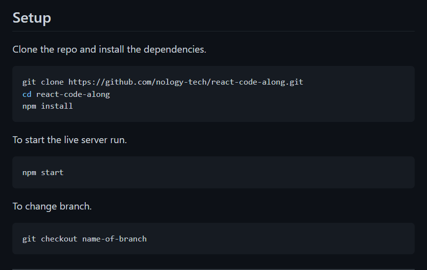

# Feedback

_Right click on the file and click Open Preview or `ctrl/cmd + shift + v` to open preview_

## Goals

1.  Working Calculator:

    - Yes a 100% working calculator with lots of UI features and different bits of functionality added into the project.

2.  Practice using Git / Github Flow:

    - Yes, 3 branches and 43 meaningful commits! Amazing, keep it up.
    - "added for charlie" :)

3.  Application of what you are learning

    - 110%, It looks great and you are still using SCSS, BEM etc which is great.
    - I can see you using each of the topics we have covered so far in the JS. Except Classes but thats cool.
    - You want to move your main.css file to the root of the project. So out of your scss folder.
    - Your base, components and layouts file would normally be prefixed with a \_ to indicate that they are a partial. main is the file that brings all the parts together.
      - A partial is a file that will be brought into another file.

---

## Specification

1. PSEUDOCODE - not sure

   - I am not sure if your comments are labelling the functionality or are the steps you took in breaking down the problem.
   - If it is pseudo code just move it to is own section in your readme.
     - Perhaps it is called "thought process" and you basically say you were working on decomposing a problem.

2. README - done

   - Yes it is done and looks great I love the spiel, you could add a set up section like below.



- If someone was interested just how they can get it on their machine.

3. 15 commits - done

4. EVAL? - done

5. CAN'T EXPLAIN IT, YOU CANT USE IT - done

   - All good in terms of your code it is very readable and logical. I think if you had to you would be able to talk through it line by line.

---

## Overall

A solid calculator in terms of functionality and UX / UI. Good going mate, I can see piece of everything we have covered so far which is great. Your code reads well as well which is a bonus. I love the easter egg, should you add a little console.log message saying about it?

---

## To work on

This is just constructive so you do not have to implement it, its just to tie it up with bows and ribbons.

## Bugs

- If you do a calculation and then add another calculation it will give you NaN e.g. 5 + 5 = will give you 10, then if you press 6 + 6 it will give you NaN.
- Not a bug. Could you add more contrast on the selected operator?

```scss
.clicked {
  background-color: #ffce1f !important;
  color: #1c1c1c !important;
}
```

## House keeping

- Remove comments / pseudo code / commented out code
- console.log()

## Dry

There is a couple of places that you repeat logic / can simplify it.

Your code

```js
// lines 144 - 167
deleteBtn.addEventListener("click", () => {
  if (display === "") {
    store = "";
    display = "";
    prevOperator = "";
    currentOperator = "";
    updateScreen(display);
    styleOperator();
    // return;
  } else {
    display = display.substring(0, display.length - 1);
    updateScreen(display);
  }
});

clearBtn.addEventListener("click", () => {
  store = "";
  display = "";
  prevOperator = "";
  currentOperator = "";
  updateScreen(display);
  styleOperator();
});
```

Could be

```js
const clearAll = () => {
  store = "";
  display = "";
  prevOperator = "";
  currentOperator = "";
};

deleteBtn.addEventListener("click", () => {
  if (display === "") {
    clearAll();
    styleOperator();
  } else {
    display = display.substring(0, display.length - 1);
  }
  updateScreen(display);
});

clearBtn.addEventListener("click", () => {
  clearAll();
  updateScreen(display);
  styleOperator();
});
```
